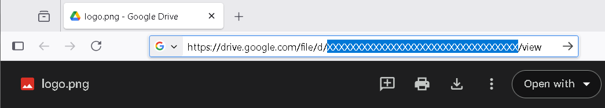

# ❀floristream tones gallery

A simple responsive gallery using plain HTML, CSS and JavaScript, without any external dependencies. The images are stored on Google Drive.  

### CSV file

The gallery imports the image catalog from a CSV file. The CSV file has the following fields:

`RGB,ID,Label`

`RGB` is the tone color in hexadecimal format without the `#` symbol.
This RGB value is used in the CSS context only. Therefore, it's safe to use the abbreviated 3-character values, for example: FFF, 000.  
`ID` is the unique file ID on Google Drive (see below).  
`Label` is the text label for the current picture. For the sake of simplicity the CSV parser doesn't handle escaping.
Therefore, the text label should not contain commas.  

For example:

```
FFF,XXXXXXXXXXXXXXXXXXXX,White color
800000,XXXXXXXXXXXXXXXXXXXX,Maroon color
```

### Google Drive File ID

If you store the image files for the gallery on Google Drive, it's necessary to make these files viewable by any user.
You can grant public access to each specific file or to the directory where all the images are stored. Just open
the **Share** dialog and select **Anyone with the link** under **General Access**. The *role* should be set to **Viewer**
to prevent modifications.  

The File ID is a unique identifier assigned to each file on Google Drive. You can use the menu **Open with** 🡒 **Open in new tab**
to see the File ID in the URL:  


Just copy the File ID from the URL to the CSV file.  

### Copying

Feel free to reuse the gallery [source code](src/gallery.js). It was released by [Vladimir Kameñar](https://github.com/vkamenar)
to the public domain. The source code is based on a minimalistic AJAX driver compatible even with older browsers like IE6.
Please, don't copy the sample images. They are copyrighted by their respective authors.  
